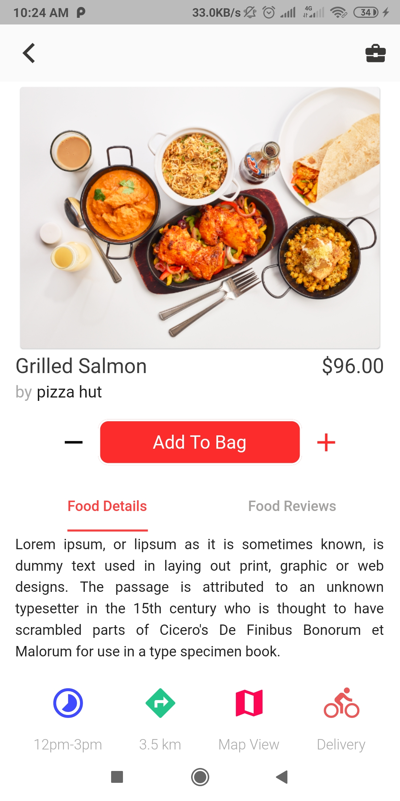

# 🍔 Flutter Food Delivery UI App

A beautifully designed **Food Delivery Mobile Application UI** built using **Flutter**.  
This project focuses on delivering a clean, modern, and responsive user interface for a food ordering experience.

---

## 📱 Overview

This app provides a visually appealing interface for:
- Browsing food items 🍕
- Viewing popular and best foods 🍔
- Exploring restaurant-style layouts 🏪
- Smooth navigation experience 📲

> ⚠️ Note: This is a **UI-only project** (no backend integration).

---

## ✨ Features

- 🎨 Modern & clean UI
- 📱 Responsive mobile design
- 🍟 Food categories and listing
- 🔥 Popular food section
- 🛒 Cart UI
- 🔍 Search screen
- 👤 Profile UI

---

## 🛠️ Tech Stack

- Flutter
- Dart
- Material UI

---

## 📂 Project Structure
├── lib

├── assets/
│ ├── images/ # Images used in UI
│ └── fonts/ # Custom fonts

│
├── android/ # Android config
├── ios/ # iOS config
├── pubspec.yaml # Dependencies
└── README.md


---

## 🚀 Getting Started

### 1. Clone the Repository

```bash
git clone https://github.com/your-username/flutter-food-delivery-app-ui.git

flutter pub get

flutter run
```

### ScreenShots
### Home Page


### Food Details Screen & Add To Cart Screen
 &nbsp;&nbsp;&nbsp;&nbsp; 

### Login & Registration Screen
&nbsp;&nbsp;&nbsp;&nbsp; 
---
## 🔮 Future Improvements
- Backend Integration (Firebase / APIs)
- Payment Gateway (Razorpay / Stripe)
- Real-time Order Tracking
- User Authentication


